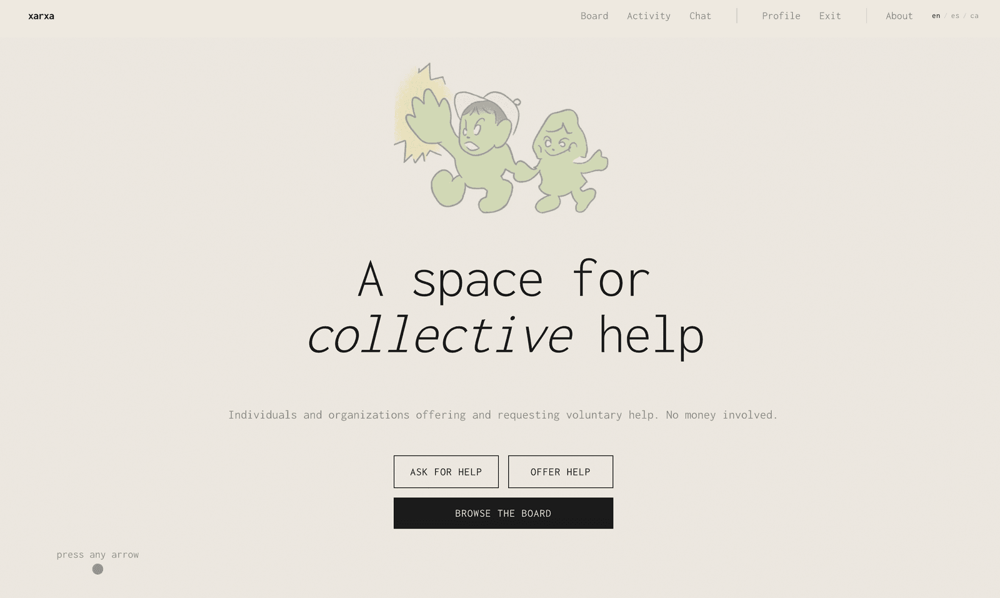

# xarxa



A volunteer service exchange platform where individuals and collectives can offer or request services for free. Think of it as a community bulletin board with real-time chat.

## Features

- **User registration** — sign up as a private individual or collective (NGO, association, etc.), with Google OAuth support
- **Service posts** — create, edit, close, reopen, and delete offers or requests across categories (Legal, Education, Health, Technology, Manual Work, Translation)
- **Public board** — browse with pagination, search by title/description/tags, filter by type and category
- **Matching** — express interest in a post; when accepted, a private chat opens automatically
- **Real-time chat** — one-to-one messaging with Socket.io, message deduplication, reconnection, date separators
- **Real-time notifications** — Socket.io push notifications (no polling), badge counts on Dashboard and Chat
- **Profiles** — photo upload (auto-resized to 512x512 WebP), skills, spoken languages, city autocomplete (OpenStreetMap), surname for individuals
- **Chat management** — delete conversations with inline confirmation
- **Account deletion** — full cascading deletion of all user data
- **i18n** — full support for English, Spanish, and Catalan with cookie-based locale switching

## Tech Stack

| Layer | Technology |
|-------|-----------|
| Framework | Next.js 14 (App Router) |
| Language | TypeScript |
| Styling | Tailwind CSS |
| Database | PostgreSQL |
| ORM | Prisma 7 (with `@prisma/adapter-pg`) |
| Auth | NextAuth.js v5 (credentials + Google OAuth) |
| Real-time | Socket.io |
| Validation | Zod |
| Containerization | Docker Compose |

## Getting Started

### Prerequisites

- Node.js 20+
- Docker and Docker Compose (for PostgreSQL)
- npm

### Setup

1. **Clone the repository**
   ```bash
   git clone https://github.com/ltanzi/xarxa.git
   cd xarxa
   ```

2. **Install dependencies**
   ```bash
   npm install
   ```

3. **Set up environment variables**
   ```bash
   cp .env.example .env
   ```
   Edit `.env` if needed. Defaults work for local development.

4. **Start PostgreSQL**
   ```bash
   docker compose up -d postgres
   ```

5. **Set up the database**
   ```bash
   npx prisma db push
   ```

6. **Seed demo data**
   ```bash
   npx prisma db seed
   ```

7. **Start the development server**
   ```bash
   npm run dev
   ```

8. **Open** [http://localhost:3000](http://localhost:3000)

### Demo Accounts

All passwords: `Password1!`

| Email | Name | Type | Location |
|-------|------|------|----------|
| info@foc.cat | F O C | Collective | Barcelona |
| hola@caninofm.com | Canino FM | Collective | Barcelona |
| emma@example.com | Emma Whitfield | Private | Barcelona |
| marc@example.com | Marc Puig | Private | Barcelona |
| sofia@example.com | Sofia Romero | Private | Barcelona |

### Deploy script

For quick updates (pull + install + start):

```bash
./deploy.sh          # pull latest and start
./deploy.sh --fresh  # reset database and reseed
```

See [docs/deploy-macbook.md](docs/deploy-macbook.md) for full deployment guide.

## Environment Variables

| Variable | Description | Required |
|----------|-------------|----------|
| `DATABASE_URL` | PostgreSQL connection string | Yes |
| `NEXTAUTH_SECRET` | Random secret for JWT signing | Yes |
| `NEXTAUTH_URL` | App URL (http://localhost:3000) | Yes |
| `GOOGLE_CLIENT_ID` | Google OAuth client ID | No |
| `GOOGLE_CLIENT_SECRET` | Google OAuth client secret | No |

## Project Structure

```
src/
├── app/             # Next.js App Router (pages + API routes)
├── components/      # React components (ui, layout, posts, chat, profile)
├── lib/             # Shared utilities (prisma, auth, validations)
├── types/           # TypeScript type definitions
└── i18n/            # Translation system
prisma/
├── schema.prisma    # Database schema
└── seed.ts          # Seed data
server.ts            # Custom server (Next.js + Socket.io)
```

## Scripts

| Command | Description |
|---------|-------------|
| `npm run dev` | Start development server |
| `npm run build` | Build for production |
| `npm start` | Start production server |
| `npm run lint` | Run ESLint |
| `npm run db:push` | Push schema to database |
| `npm run db:seed` | Seed demo data |
| `npm run db:studio` | Open Prisma Studio |

## License

MIT
